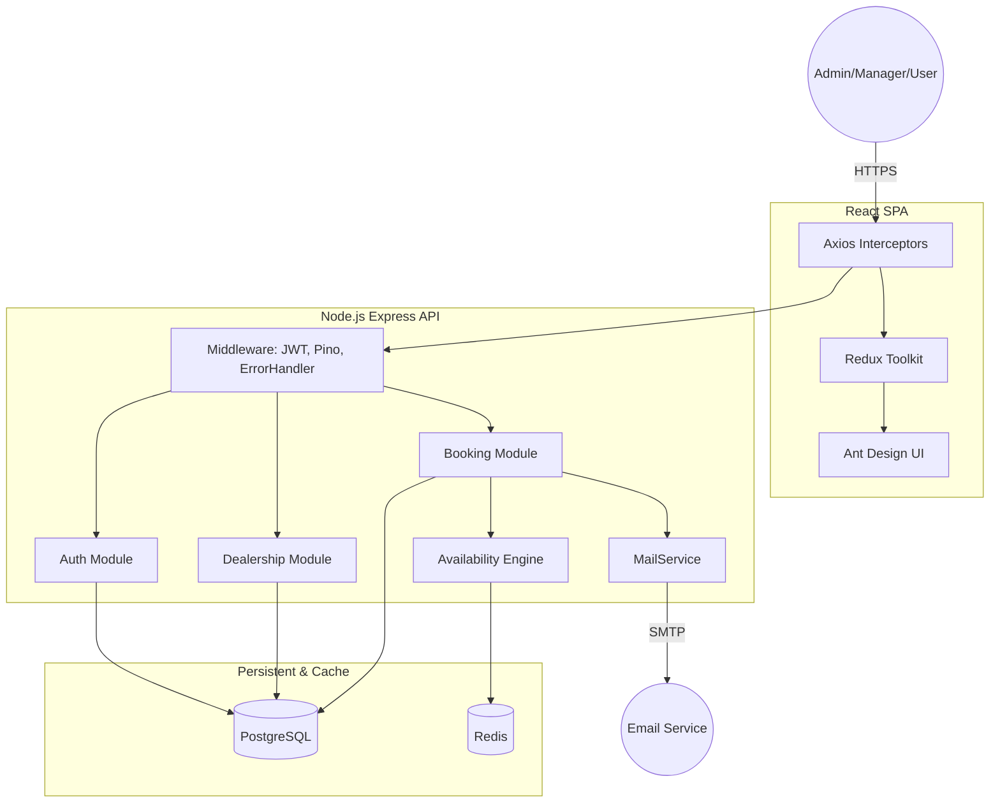
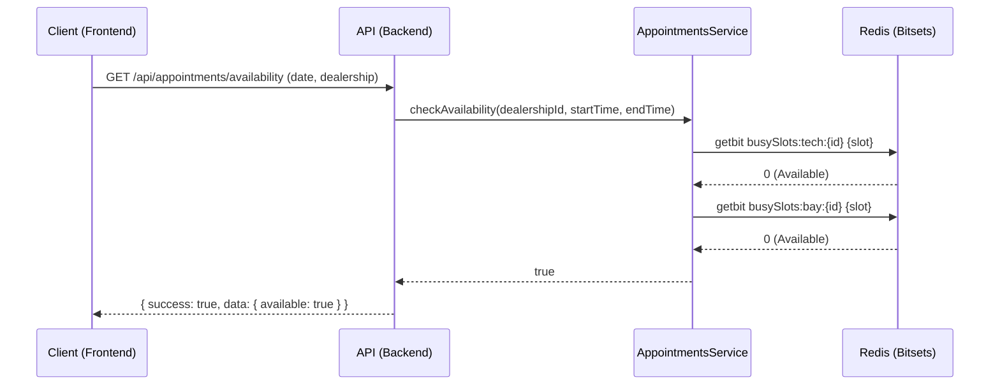
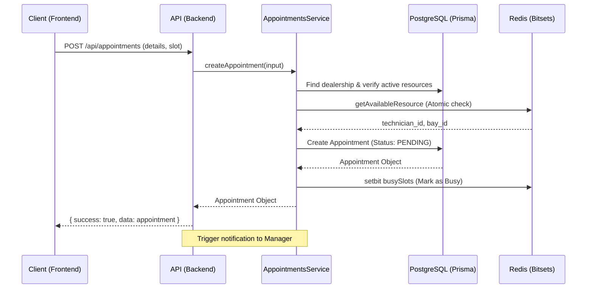

# Unified Service Scheduler

A full-stack appointment scheduling application for vehicle service dealerships, enabling customers to book services and managers to oversee resource allocation.

## 1. Architecture

### 1.1 System Architecture Diagram



### 1.2 Component Descriptions

#### Frontend Layer (React 19 + Vite)
- **UI Components**: Built using **Ant Design (antd)** for a consistent, enterprise-grade user interface, styled with **Tailwind CSS v4**.
- **State Management**: **Redux Toolkit** handles appointment data, dealership lists, and user authentication state.
- **API Client**: **Axios** with interceptors manages JWT token attachment, request/response cycle, and error handling.

#### Backend Layer (Node.js Express API)
- **Middleware Layer**: Centralized **JWT Guard**, **Pino Logger**, and **Global Error Handler** for request interception and monitoring.
- **Auth Module**: Handles registration, login, and stateless JWT issuance/validation.
- **Dealership Module**: Manages dealerships, active technicians, and vehicle bays.
- **Booking Module**: Orchestrates the appointment lifecycle (Availability checking -> Resource Locking -> Creation -> Approval).
- **MailService**: Uses Nodemailer to send transactional emails for booking confirmations.

#### Logic Layer (Availability Engine)
- **Availability Engine**: Core scheduling logic that matches technician and bay availability. It uses **Redis bitsets** and TTL-based locks to prevent double-booking.

#### Data & Cache Layer
- **PostgreSQL**: Primary persistent storage for structured domain data (Users, Appointments, Technicians).
- **Redis**: High-performance cache for slot-level availability tracking (bitsets), session-level JWT blacklisting, and temporary resource locks.

### 1.3 Data Flow

1.  **Resource Initialization**: Admin/Managers populate dealerships with active Technicians and Vehicle Bays.
2.  **Availability Querying**: Customers select a service and date; the `Availability Engine` queries Redis for unassigned slots.
3.  **Booking Submission**: Customer submits booking info; the system performs a final atomic lock in Redis, creates a `PENDING` database entry, and notifies the manager.
4.  **Staff Approval**: Manager reviews the `Schedule` view, confirms resource assignment, and updates status to `SCHEDULED`, triggering a final confirmation email.

### 1.4 Sequence Diagrams

#### Flow 1: Checking Availability


#### Flow 2: Booking Flow


## 2. Technology Stack

| Tech | Justification |
| :--- | :--- |
| **Node.js (Express)** | Fast I/O, mature ecosystem, and easily scalable for a monolith structure. |
| **React 19 + Vite** | High-performance frontend with rapid build times and modern state hooks. |
| **TypeScript** | Enforces type-safety across layers, significantly reducing runtime errors. |
| **Ant Design (antd)** | Robust component library for complex enterprise UIs (Dashboards, Tables, Calendars). |
| **Tailwind CSS v4** | Modern utility-first CSS framework for layout and custom styling. |
| **Redux Toolkit** | Handles complex booking state, auth tokens, and search filters cleanly. |
| **Prisma ORM** | Type-safe database queries and automated schema migrations for PostgreSQL. |
| **PostgreSQL** | Reliable relational database for complex joins between appointments and resources. |
| **Redis** | Sub-millisecond performance for the `Availability Engine` and distributed locking. |
| **Pino** | Low-overhead JSON logger for high-performance structured logging. |
| **Nodemailer** | Handles transactional emails via SMTP. |

## 3. Getting Started

### 3.1 Infrastructure (Docker)
The project uses Docker Compose to manage PostgreSQL and Redis.
```bash
docker-compose up -d
```
- **PostgreSQL**: `localhost:5432`
- **Redis**: `localhost:6379`

### 3.2 Backend Setup
1. `cd backend`
2. `npm install`
3. `cp .env.example .env` (Configure `DATABASE_URL`, `REDIS_URL`, `JWT_SECRET`)
4. `npx prisma migrate dev --name init`
5. `npx prisma db seed`
6. `npm run dev` (API at `http://localhost:3001`)

### 3.3 Frontend Setup
1. `cd frontend`
2. `npm install`
3. `npm run dev` (App at `http://localhost:5173`)

### 3.4 Default Credentials
- **Email**: `admin@mail.com`
- **Password**: `password`

## 4. Testing

### 4.1 Purpose
Ensure reliability of core business logic, including resource allocation, constraint enforcement (e.g., no double-booking), and RBAC.

### 4.2 Suite of Tests
- **Appointments Service**: Validates creation, listing (RBAC), and cancellation (resource release).
- **Dealerships Service**: Tests CRUD, in-memory filtering, and permission checks.

### 4.3 Execution
Run backend tests:
```bash
cd backend
npm test
```

## 5. Observability

- **Logging**: Uses `pino` for structured JSON logging and `pino-http` for request tracing.
- **Error Handling**: Centralized middleware catches all exceptions and returns standardized `ApiResponse` structures.
