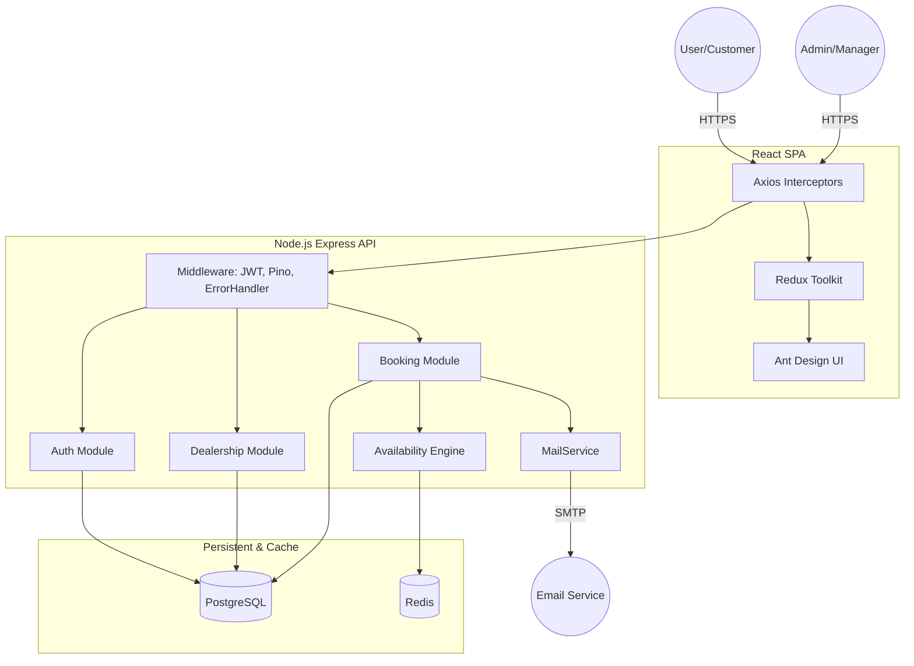

# System Design Document: Unified Service Scheduler

## 1. Architecture Diagram

### Preview Link: 
https://mermaid.ai/view/064bb723-d18e-48c2-9780-b9d710236b59

## 2. Component Descriptions

### Frontend Layer (React 19 + Vite)
- **UI Components**: Built using **Ant Design (antd)** for a consistent, enterprise-grade user interface.
- **State Management**: **Redux Toolkit** handles appointment data, dealership lists, and user authentication state.
- **API Client**: **Axios** with interceptors manages JWT token attachment, request/response cycle, and error handling.

### Backend Layer (Node.js + Express)
- **Middleware Layer**: Centralized **JWT Guard**, **Pino Logger**, and **Global Error Handler** for request interception and monitoring.
- **Auth Module**: Handles registration, login, and stateless JWT issuance/validation.
- **Dealership Module**: Manages dealerships, active technicians, and vehicle bays.
- **Booking Module**: Orchestrates the appointment lifecycle (Checking availability -> Resource Locking -> Creation -> Approval).
- **Notification Module**: Uses **MailService** (wrapped Nodemailer) to send TRANSACTIONAL emails for booking confirmations.

### Logic Layer (Availability Engine)
- **Availability Engine**: Core scheduling logic that matches technician and bay availability. It uses Redis bitsets and TTL-based locks to prevent double-booking.

### Data & Cache Layer
- **PostgreSQL**: Primary persistent storage for structured domain data (Users, Appointments, Technicians).
- **Redis**: High-performance cache for slot-level availability tracking and session-level JWT blacklisting.

## 3. Data Flow

1.  **Resource Initialization**: Admin/Managers populate dealerships with active Technicians and Vehicle Bays (represented via the `Vehicle` model).
2.  **Availability Querying**: Customers select a service and date; the `Availability Engine` queries Redis for unassigned slots and calculates durations.
3.  **Booking Submission**: Customer submits booking info; the system performs a final atomic lock in Redis, creates a `PENDING` database entry, and emits a notification for manager approval.
4.  **Staff Approval**: Manager reviews the `Schedule` view, confirms resource assignment, and updates status to `SCHEDULED`, which triggers a final confirmation email.

## 4. Technology Stack & Justifications

| Tech | Justification |
| :--- | :--- |
| **Node.js (Express)** | Fast I/O, mature ecosystem, and easily scalable for a monolith structure. |
| **React 19 + Vite** | High-performance frontend with rapid build times (Vite) and modern state hooks. |
| **Ant Design (antd)** | Robust component library for complex enterprise UIs (Dashboards, Tables, Calendars). |
| **TypeScript** | Enforces type-safety across front/back layers, significantly reducing runtime errors. |
| **Prisma ORM** | Type-safe database queries and automated schema migrations for PostgreSQL. |
| **PostgreSQL** | Reliable relational database for complex joins between appointments and resources. |
| **Redis** | Sub-millisecond performance for the `Availability Engine` and distributed locking. |
| **Pino & pino-http** | Low-overhead JSON logger for high-performance structured logging. |

## 5. strategy for Observability

### Logging
- **Structured Logging**: Uses `pino` to output JSON logs, allowing for easy parsing by centralized monitoring systems (e.g., ELK Stack, CloudWatch).
- **Request Tracing**: `pino-http` logs every incoming request with status code, latency, and request metadata.

### Error Handling
- **Centralized Middleware**: A global Express error handler catches all unhandled exceptions and returns a standardized `ApiResponse` structure (success: false, code, errors).
- **Diagnostic Mode**: In development environments, error stack traces are exposed for rapid debugging; in production, they are replaced with generic messages to prevent data leakage.

## 6. GenAI Assistance in Design

*(TODO: Add more details)*
